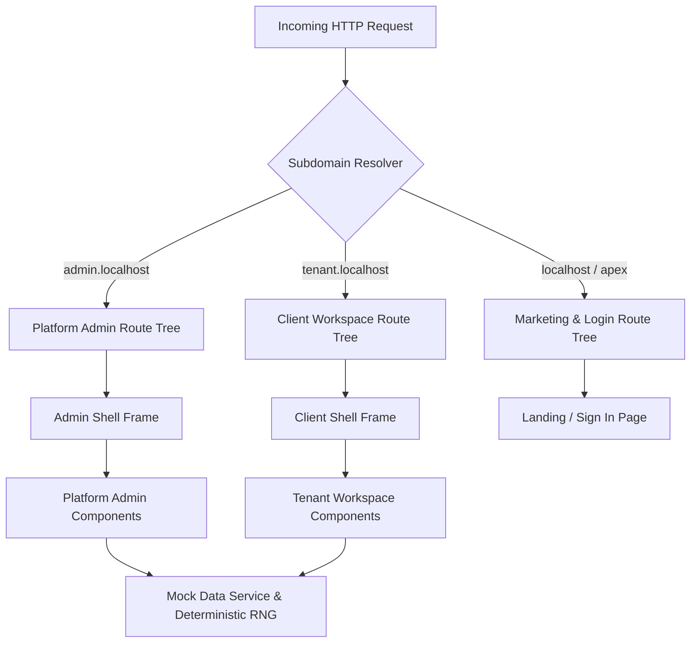

# BUGConnect — System Architecture & Developer Blueprint

This document provides a comprehensive technical architecture, data model specification, security model, and implementation guide for **BUGConnect**. It is designed as an authoritative reference for human software engineers and AI coding assistants.

---

## 1. System Overview & Core Objectives

**BUGConnect** is a multi-tenant WhatsApp Business SaaS platform that allows enterprises and SMBs to operate one official WhatsApp Business Account (WABA) with a team of agents, automated chat flows, native WhatsApp form collection, template management, and outbound campaigns.



### Key Functional Modules:
1. **Platform Admin Console (`admin.localhost:4200`)**: Governs onboarded client tenants, platform staff users, subscription plans, platform telemetry, and webhook ingestion queues.
2. **Tenant Workspace Console (`<tenant>.localhost:4200`)**: Operational portal for business staff to handle live customer conversations in the Team Inbox, manage users & roles, build automated flows, and configure settings.
3. **Public Marketing & Login Site (`localhost:4200`)**: Public marketing landing page, product documentation, pricing tiers, and host-aware unified login gateway.

---

## 2. Multi-Tenant Subdomain Routing Pipeline

Multi-tenancy is enforced at the network & route resolution layer before any component mounts or renders.

### Resolution Algorithm (`src/app/core/workspace/subdomain.resolver.ts`):
- `admin.localhost` or `admin.*` → `WorkspaceKind: 'platform'`
- `<slug>.localhost` or `<slug>.*.e2b.app` (where slug ≠ `admin`) → `WorkspaceKind: 'client'`, `slug: '<slug>'`
- `localhost`, `127.0.0.1`, apex domain → `WorkspaceKind: 'marketing'`
- **Dev Override**: On non-tenant hosts (e.g. plain `localhost:4200`), appending `?ws=<slug>` or having `localStorage['bugconnect-dev-workspace'] = '<slug>'` activates `source: 'dev-override'`.

### SSR & Host Context (`src/app/core/workspace/workspace-context.ts`):
- **Server Context**: Reads the incoming HTTP `Host` header via `@angular/core` `REQUEST` token (`new URL(request.url, 'http://localhost')`).
- **Browser Context**: Inspects `window.location.hostname` and `window.location.search`.
- **SSR Prerendering Disabled**: All routes in `app.routes.server.ts` use `RenderMode.Server` (`** → RenderMode.Server`) to guarantee host header evaluation per request.
- **SSR Build Wiring**: `angular.json` sets `server`, `outputMode: server` and `ssr.entry` so `ng build` emits `dist/BUGConnect/server/server.mjs` (served via `serve:ssr`). `src/server.ts` passes an `allowedHosts` list (`localhost`, `*.localhost`, `127.0.0.1`) to `AngularNodeAppEngine` — multi-tenant hosts are the normal case here, and Angular's SSRF validation would otherwise reject every tenant `Host` header and silently fall back to CSR. Production adds its apex and tenant suffix to the same list.

### Isolated Route Trees (`src/app/app.routes.ts`):
Routes are split into three `canMatch` guarded branches:
- `adminGuard`: Matches routes on `admin.localhost` only.
- `clientGuard`: Matches routes on tenant subdomains (e.g. `nazeel.localhost`).
- `marketingGuard`: Matches routes on public host.

This guarantees that platform routes (`/clients`) are inaccessible on tenant hosts: each branch's `**` wildcard redirects the request to that host's own `/` (`302`), so no tree can ever leak another tree's pages.

---

## 3. Data Dictionary & Entity Schemas (`src/app/core/data/entities.ts`)

### `Tenant`
Represents an onboarded client business workspace.
```typescript
export type TenantStatus =
  | 'lead_trial'
  | 'onboarding'
  | 'whatsapp_pending'
  | 'active'
  | 'suspended'
  | 'archived';

export type Tenant = {
  id: string;
  businessName: string;
  subdomain: string;
  industry: string;
  subscriptionTier: 'Pilot' | 'Growth' | 'Scale';
  status: TenantStatus;
  metaWabaId: string | null;
  phoneNumber: string | null;
  seatsUsed: number;
  contactCount: number;
  monthlyMessages: number;
  createdAt: string; // ISO 8601
};
```

### `WorkspaceUser`
Staff member belonging to a specific tenant workspace.
```typescript
export type StaffRole = 'admin' | 'supervisor' | 'agent' | 'developer';

export type WorkspaceUser = {
  id: string;
  tenantId: string;
  fullName: string;
  email: string;
  role: StaffRole;
  roleId: string;
  department: string;
  isOnline: boolean;
  activeChatCapacity: number;
  currentActiveChats: number;
  invited: boolean;
  lastLoginAt: string;
  createdAt: string;
};
```

### `PlatformStaffUser`
Platform operator who manages tenants and system operations.
```typescript
export type PlatformStaffUser = {
  id: string;
  fullName: string;
  email: string;
  role: 'owner' | 'operations' | 'support';
  roleId: string;
  isActive: boolean;
  lastLoginAt: string;
  createdAt: string;
};
```

### `Message` (Cloud API shaped)

One row per message object sent or received. `type` is the Cloud API object; `payload` is
that object's body; `content` is a plain-text mirror kept for search, CSV export and the
queue preview.

```typescript
export type WhatsAppMessageType =
  | 'text' | 'template' | 'interactive' | 'image' | 'video' | 'audio'
  | 'voice' | 'document' | 'sticker' | 'location' | 'contacts' | 'reaction' | 'flow';

export interface MessagePayload {
  text?: string | null;        // text, internal notes
  caption?: string | null;     // image, video, document
  media?: MediaMeta | null;    // image, video, audio, voice, document, sticker
  template?: TemplatePayload | null;   // name, language, category, variables, buttons
  interactive?: InteractivePayload | null; // button | list | cta_url | flow | catalog
  location?: LocationPayload | null;
  contacts?: ContactCard[] | null;
  reaction?: ReactionPayload | null;
  flow?: { name: string; screen: string; response: Record<string, string> } | null;
}

export type Message = {
  id: string;
  conversationId: string;
  direction: 'inbound' | 'outbound';
  type: WhatsAppMessageType;
  payload: MessagePayload;
  content: string;
  mediaUrl: string | null;
  deliveryStatus: 'sent' | 'delivered' | 'read' | 'failed';
  isInternalWhisper: boolean;
  createdByUserId: string | null;
  sentAt: string;
  replyToMessageId?: string | null;
  reactions?: MessageReaction[];
  waMessageId?: string | null;
};
```

Meta's published limits live in `META_LIMITS` (`whatsapp.ts`) and are enforced by the
composer before staging: 5 MB images, 16 MB video/audio, 100 MB documents, 100 KB static
and 500 KB animated stickers, 4096-character text, 3 quick-reply buttons, 10 list rows.

### `Role` & Permission Matrix
Defines menu access and operational capabilities.
```typescript
export type MenuKey =
  | 'dashboard'
  | 'inbox'
  | 'contacts'
  | 'flows'
  | 'templates'
  | 'campaigns'
  | 'reports'
  | 'teams'
  | 'users'
  | 'roles'
  | 'quickReplies'
  | 'settings'
  | 'billing'
  | 'audit'
  | 'developer'
  | 'profile'
  | 'clients'
  | 'plans'
  | 'subscriptions'
  | 'invoices'
  | 'metaConfig'
  | 'health'
  | 'announcements'
  | 'analytics';

export type Role = {
  id: string;
  name: string;
  tenantId: string | null; // null for default system templates
  system: boolean;
  menus: MenuKey[];
  capabilities: Record<string, 'none' | 'view' | 'edit' | 'full'>;
};
```

---

## 4. Authentication & RBAC Authorization

### `SessionService` (`src/app/core/auth/session.service.ts`):
- Controls user state: `user = signal<SessionUser | null>(null)`.
- Handles sign in, credentials resolution (`resolveUser()`), logout, and session persistence in `localStorage['bugconnect-session-v2']`. The server cannot read this store, so `authGuard` and `permissionGuard` pass on the server and re-enforce in the browser after hydration.
- Demo Accounts & Credential Mappings:
  - `systemadmin` / `admin@123` → Platform Owner (`admin.localhost`).
  - `admin` / `admin@123` → Workspace Admin (`nazeel.localhost`).
  - `supervisor` / `admin@123` → Supervisor.
  - `agent` / `admin@123` → Support Agent.
  - `developer` / `admin@123` → Integration User (Developer Hub).

### `PermissionService` (`src/app/core/authorization/permission.service.ts`):
- Evaluates active user role against required capabilities and permitted menus.
- Exposes `visibleMenu()` computed signal for sidebar shell rendering.
- `can(capability, requiredLevel)` evaluates fine-grained operational rights.

---

## 5. UI Architecture & Reusable Component Specs

### `<app-data-table>` (`src/app/shared/data-table/`):
Full-featured data table component with zero third-party UI dependencies:
- **Inputs**:
  - `columns: DataColumn<T>[]`: Column definitions (key, label, sortable, align, width).
  - `rows: T[]`: Data array.
  - `loading: boolean`: Displays skeleton loader rows when true.
  - `error: string | null`: Renders inline error state.
  - `selectable: boolean`: Renders checkbox selection column.
  - `activatable: boolean`: Makes rows clickable.
  - `exportName: string`: Name prefix for CSV exports.
- **Cell Customization**:
  - Accepts custom templates via `<ng-template appCell="columnKey" let-row>`.

### UI Primitives (`src/app/shared/ui/ui.ts`):
- `PageHeader`: Standardized top header with title, eyebrow, description, and action button slot (`pageActions`).
- `StatusPill`: Badge component (`success`, `warning`, `danger`, `info`, `neutral`).
- `ConfirmDialog`: Modal dialog for destructive action confirmations.
- `PlannedState`: Empty state placeholder for deferred product modules.

### Team Inbox (`src/app/client/inbox/`)

```
inbox-shell                     queue pane + <router-outlet>
├── inbox-empty                 right-pane placeholder
└── conversation-detail/
    ├── conversation-detail-page  header · thread · composer orchestration
    ├── message-bubble            one branch per Cloud API message object
    ├── message-composer          text, staging, attach/emoji/sticker panels
    ├── contact-panel             customer record beside the thread
    └── dialogs/                  template · interactive · location · contact
```

#### Fixed-pane layout contract

The inbox is a full-height surface, so the shell itself must not scroll. Three rules make
that work, and all three are required — dropping any one of them reintroduces page scroll:

1. `.shell` is `height: 100dvh; overflow: hidden`; `.shell__body` is
   `grid-template-rows: auto minmax(0, 1fr)`; `.shell__main` scrolls page content by
   default and opts out with `:has(.inbox-layout)`.
2. Every flex child in the chain — `app-inbox-shell`, `app-conversation-detail-page`,
   `.inbox-layout`, `.inbox-queue`, `.inbox-main`, `.conv-detail`, `.conv-body`,
   `.conv-scroll` — sets `min-height: 0`. Without it the browser lets content grow the
   box instead of scrolling inside it.
3. Only `.inbox-list`, `.conv-thread` and `.ctx` are scroll containers, each with
   `overscroll-behavior: contain` so the wheel never chains to the page.

Responsive: ≥1180px three panes · <1180px the customer panel overlays · <900px the queue
and the thread swap (`.inbox-layout--thread-open`, driven from `NavigationEnd`).

#### Outbound message pipeline

```
composer (stages files, validates)  →  ComposerSend[]
  → ConversationDetailPage.send()   →  MockDataService.sendOutbound(draft)
  → dataset signal                  →  thread re-renders, delivery ticks advance
```

`whatsapp.ts` owns the contract: `WhatsAppMessageType`, the discriminated
`MessagePayload`, `META_LIMITS` (sizes, button counts, character caps),
`META_MIME_ACCEPT`, `renderTemplateBody()` and `payloadPreview()`. Swapping the mock for
the .NET API means replacing `MockDataService` only — no component imports the transport.

---

## 6. Comprehensive Implementation Roadmap (Waves 1–6)

### Wave 1: Foundation (COMPLETED ✅)
- Core workspace context, auth session, RBAC permission matrix, menu catalogue.
- DataTable component, shell frames (`AdminShell`, `ClientShell`, `ShellFrame`).
- Pages: Landing page, Login page, Client Users list & form, Client Roles list & matrix, Client & Admin Dashboards, Admin Clients list, Platform Staff list, Profile page, Error pages (`404`, `no-access`).
- Rebranding to **BUGConnect**, credential mapping, dev server host header fix, login UI fixes, responsive layout fixes, 75/75 passing unit tests.

### Wave 2: Team Inbox & Conversation Queue (`[x]`)
- **Pages**: `/inbox` (Split-pane view), `/inbox/:conversationId` (Active thread view).
- **Features**:
  - Weighted agent load router simulation (assigns new chats to online agents under capacity).
  - Queue filters: `Unassigned`, `Mine`, `Open`, `Resolved`, with live counts and search.
  - Message bubble rendering for **every Cloud API object**: text, image, video, audio,
    voice note, document, sticker (static + animated), location, contact card, template,
    interactive (quick replies / CTA / list / flow), WhatsApp Flow responses and reactions.
  - Agent action panel: internal notes, reassignment dropdown, status toggle, priority.
  - Fixed-pane layout with independent scroll for queue, thread and customer panel.
  - Thread ergonomics: day separators, quote-replies, hover reactions, jump-to-latest,
    lightbox, drag-and-drop attachments, `{{n}}` template variables, slash shortcuts.

### Wave 3: Client Operations & Directory (`[~]` in progress)
- **Contact Hub** (`/contacts`, `/contacts/:id`): Directory with tags, segments, lead status, opt-out enforcement. SHIPPED 2026-10-10 (first of 9 entries; remaining 8 unstarted — see TODO.md).

### Wave 4: Platform Admin Governance (`[x]` — shipped 2026-10-10)
- **Onboard Client Wizard** (`/clients/new`): 3-step provisioning with subdomain validation, tier preview, and trial onboarding.
- **Client Detail View** (`/clients/:id`): Overview, seats, WABA status, subscription, and history tabs with tier moves and suspend/reactivate.
- **Plans** (`/plans`, `/plans/edit`, `/plans/matrix`): Tier overview, limits editor, and module × tier feature matrix that re-gates client sidebars live.
- **Subscriptions** (`/subscriptions`, `/subscriptions/log`): Per-tenant current state derived from the event trail plus the transition log.
- **Invoices** (`/invoices`): Status-filtered platform invoice records.
- **Meta App Configuration** (`/meta-config`): App ID/secret, callback + verify token management, connected numbers.
- **Queue & Webhook Monitor** (`/health/monitor`): Ack p50/p95/max, latency distribution, dead-letter acknowledgement.
- **WhatsApp Connection** (`/settings/whatsapp`, `/settings/whatsapp/callback`): Embedded-Signup handoff and OAuth callback exchange (client-side entries in the W4 list).

### Wave 5: Lifecycle & Self-Service (`[ ]`)
- **Billing & Subscriptions** (`/billing`): Payment method management, usage invoice downloads.
- **Audit Logging** (`/audit`): System activity log for security events, user changes, and administrative actions.
- **Self-Service Auth** (`/forgot-password`, `/reset-password`, `/accept-invite`).
- **Suspended Workspace State** (`/suspended`): Graceful lock screen for suspended tenants.

### Wave 6: Advanced Automation & Analytics (`[ ]`)
- **Flow Builder Canvas** (`/flows`): Visual canvas for designing greeting flows, menu choices, and human handoff nodes.
- **WhatsApp Flows Studio** (`/whatsapp-flows`): Visual form builder for multi-screen native WhatsApp forms.
- **Campaign Manager** (`/campaigns`): Broadcast wizard, audience segment picker, delivery rate monitor.
- **Executive Analytics** (`/reports`): Resolution time metrics, campaign conversion rates, agent performance reports.

---

## 7. Developer & AI Assistant Guidelines

1. **Strict Signal Usage**: All new state MUST use Angular Signals (`signal()`, `computed()`, `effect()`).
2. **OnPush Strategy**: Set `changeDetection: ChangeDetectionStrategy.OnPush` on all components.
3. **No Direct DOM Mutations**: Always manipulate UI state via Angular template bindings.
4. **Preserve CSS Tokens**: Use the variables defined in `src/styles/tokens.css` (`var(--theme-brand)`, `var(--theme-surface)`, `var(--radius-md)`, `var(--theme-shadow-sm)`, etc.). Never hard-code colours, radii or shadows in a stylesheet.
5. **Global Styling Only**: Components have no `styleUrl` or inline `styles`. Every rule lives under `src/styles/` (`tokens.css` → `base.css` → `components/` → `pages/`), imported in cascade order from `src/styles.css`. `src/app/styles-convention.spec.ts` enforces this.
5. **Verification**: Always run `npx ng test --watch=false` after writing code. Ensure all unit tests pass before considering a task finished.
