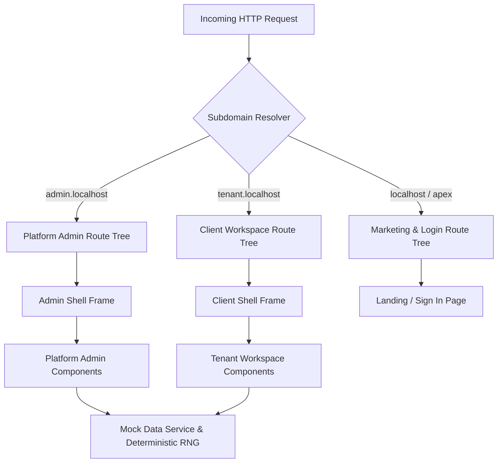

# BUGConnect — System Architecture & Developer Blueprint

This document provides a comprehensive technical architecture, data model specification, security model, and implementation guide for **BUGConnect**. It is designed as an authoritative reference for human software engineers and AI coding assistants.

---

## 1. System Overview & Core Objectives

**BUGConnect** is a multi-tenant WhatsApp Business SaaS platform that allows enterprises and SMBs to operate one official WhatsApp Business Account (WABA) with a team of agents, automated chat flows, native WhatsApp form collection, template management, and outbound campaigns.



### Key Functional Modules:
1. **Platform Admin Console (`admin.localhost:4200`)**: Governs onboarded client tenants, platform staff users, subscription plans, platform telemetry, and webhook ingestion queues.
2. **Tenant Workspace Console (`<tenant>.localhost:4200`)**: Operational portal for business staff to handle live customer conversations in the Team Inbox, manage users & roles, build automated flows, and configure settings.
3. **Public Marketing & Login Site (`localhost:4200`)**: Public marketing landing page, product documentation, pricing tiers, and host-aware unified login gateway.

---

## 2. Multi-Tenant Subdomain Routing Pipeline

Multi-tenancy is enforced at the network & route resolution layer before any component mounts or renders.

### Resolution Algorithm (`src/app/core/workspace/subdomain.resolver.ts`):
- `admin.localhost` or `admin.*` → `WorkspaceKind: 'platform'`
- `<slug>.localhost` or `<slug>.*.e2b.app` (where slug ≠ `admin`) → `WorkspaceKind: 'client'`, `slug: '<slug>'`
- `localhost`, `127.0.0.1`, apex domain → `WorkspaceKind: 'marketing'`
- **Dev Override**: On non-tenant hosts (e.g. plain `localhost:4200`), appending `?ws=<slug>` or having `localStorage['bugconnect-dev-workspace'] = '<slug>'` activates `source: 'dev-override'`.

### SSR & Host Context (`src/app/core/workspace/workspace-context.ts`):
- **Server Context**: Reads the incoming HTTP `Host` header via `@angular/core` `REQUEST` token (`new URL(request.url, 'http://localhost')`).
- **Browser Context**: Inspects `window.location.hostname` and `window.location.search`.
- **SSR Prerendering Disabled**: All routes in `app.routes.server.ts` use `RenderMode.Server` (`** → RenderMode.Server`) to guarantee host header evaluation per request.

### Isolated Route Trees (`src/app/app.routes.ts`):
Routes are split into three `canMatch` guarded branches:
- `adminGuard`: Matches routes on `admin.localhost` only.
- `clientGuard`: Matches routes on tenant subdomains (e.g. `nazeel.localhost`).
- `marketingGuard`: Matches routes on public host.

This guarantees that platform routes (`/clients`) are inaccessible on tenant hosts and return a clean `404` or `302 → /login`.

---

## 3. Data Dictionary & Entity Schemas (`src/app/core/data/entities.ts`)

### `Tenant`
Represents an onboarded client business workspace.
```typescript
export type TenantStatus =
  | 'lead_trial'
  | 'onboarding'
  | 'whatsapp_pending'
  | 'active'
  | 'suspended'
  | 'archived';

export type Tenant = {
  id: string;
  businessName: string;
  subdomain: string;
  industry: string;
  subscriptionTier: 'Pilot' | 'Growth' | 'Scale';
  status: TenantStatus;
  metaWabaId: string | null;
  phoneNumber: string | null;
  seatsUsed: number;
  contactCount: number;
  monthlyMessages: number;
  createdAt: string; // ISO 8601
};
```

### `WorkspaceUser`
Staff member belonging to a specific tenant workspace.
```typescript
export type StaffRole = 'admin' | 'supervisor' | 'agent' | 'developer';

export type WorkspaceUser = {
  id: string;
  tenantId: string;
  fullName: string;
  email: string;
  role: StaffRole;
  roleId: string;
  department: string;
  isOnline: boolean;
  activeChatCapacity: number;
  currentActiveChats: number;
  invited: boolean;
  lastLoginAt: string;
  createdAt: string;
};
```

### `PlatformStaffUser`
Platform operator who manages tenants and system operations.
```typescript
export type PlatformStaffUser = {
  id: string;
  fullName: string;
  email: string;
  role: 'owner' | 'operations';
  roleId: string;
  isActive: boolean;
  lastLoginAt: string;
  createdAt: string;
};
```

### `Role` & Permission Matrix
Defines menu access and operational capabilities.
```typescript
export type MenuKey =
  | 'dashboard'
  | 'inbox'
  | 'contacts'
  | 'flows'
  | 'whatsapp-flows'
  | 'templates'
  | 'campaigns'
  | 'reports'
  | 'teams'
  | 'users'
  | 'roles'
  | 'replies'
  | 'settings'
  | 'developer'
  | 'billing'
  | 'audit'
  | 'clients'
  | 'plans'
  | 'health'
  | 'config'
  | 'profile';

export type Role = {
  id: string;
  name: string;
  tenantId: string | null; // null for default system templates
  system: boolean;
  menus: MenuKey[];
  capabilities: Record<string, 'none' | 'view' | 'edit' | 'full'>;
};
```

---

## 4. Authentication & RBAC Authorization

### `SessionService` (`src/app/core/auth/session.service.ts`):
- Controls user state: `user = signal<SessionUser | null>(null)`.
- Handles sign in, credentials resolution (`resolveUser()`), logout, and session persistence in `sessionStorage['bugconnect-session']`.
- Demo Accounts & Credential Mappings:
  - `systemadmin` / `admin@123` → Platform Owner (`admin.localhost`).
  - `admin` / `admin@123` → Workspace Admin (`nazeel.localhost`).
  - `supervisor` / `admin@123` → Supervisor.
  - `agent` / `admin@123` → Support Agent.

### `PermissionService` (`src/app/core/authorization/permission.service.ts`):
- Evaluates active user role against required capabilities and permitted menus.
- Exposes `visibleMenu()` computed signal for sidebar shell rendering.
- `can(capability, requiredLevel)` evaluates fine-grained operational rights.

---

## 5. UI Architecture & Reusable Component Specs

### `<app-data-table>` (`src/app/shared/data-table/`):
Full-featured data table component with zero third-party UI dependencies:
- **Inputs**:
  - `columns: DataColumn<T>[]`: Column definitions (key, label, sortable, align, width).
  - `rows: T[]`: Data array.
  - `loading: boolean`: Displays skeleton loader rows when true.
  - `error: string | null`: Renders inline error state.
  - `selectable: boolean`: Renders checkbox selection column.
  - `activatable: boolean`: Makes rows clickable.
  - `exportName: string`: Name prefix for CSV exports.
- **Cell Customization**:
  - Accepts custom templates via `<ng-template appCell="columnKey" let-row>`.

### UI Primitives (`src/app/shared/ui/ui.ts`):
- `PageHeader`: Standardized top header with title, eyebrow, description, and action button slot (`pageActions`).
- `StatusPill`: Badge component (`success`, `warning`, `danger`, `info`, `neutral`).
- `ConfirmDialog`: Modal dialog for destructive action confirmations.
- `PlannedState`: Empty state placeholder for deferred product modules.

---

## 6. Comprehensive Implementation Roadmap (Waves 1–6)

### Wave 1: Foundation (COMPLETED ✅)
- Core workspace context, auth session, RBAC permission matrix, menu catalogue.
- DataTable component, shell frames (`AdminShell`, `ClientShell`, `ShellFrame`).
- Pages: Landing page, Login page, Client Users list & form, Client Roles list & matrix, Client & Admin Dashboards, Admin Clients list, Platform Staff list, Profile page, Error pages (`404`, `no-access`).
- Rebranding to **BUGConnect**, credential mapping, dev server host header fix, login UI fixes, responsive layout fixes, 75/75 passing unit tests.

### Wave 2: Team Inbox & Conversation Queue (`[ ]`)
- **Pages**: `/inbox` (Split-pane view), `/inbox/:conversationId` (Active thread view).
- **Features**:
  - Weighted agent load router simulation (assigns new chats to online agents under capacity).
  - Queue filters: `Unassigned`, `Mine`, `Open`, `Resolved`.
  - Message bubble rendering (text, media, interactive template buttons, native flow responses).
  - Agent action panel: internal notes, reassignment dropdown, status toggle, typing indicator.

### Wave 3: Client Operations & Directory (`[ ]`)
- **Contact Hub** (`/contacts`, `/contacts/:id`): Directory with tags, segments, lead status, opt-out enforcement.
- **Template Manager** (`/templates`, `/templates/new`): Synchronized Meta message templates with category, language, and variable placeholders.
- **Teams & Departments** (`/teams`): Agent department grouping and queue routing limits.
- **Quick Replies** (`/replies`): Shortcut canned responses for agents.
- **Business Settings** (`/settings`): Business profile, default queue hours, auto-responders.

### Wave 4: Platform Admin Governance (`[ ]`)
- **Onboard Client Wizard** (`/clients/new`): Multi-step form for provisioning a new tenant workspace with subdomain, subscription plan, and admin credentials.
- **Client Detail View** (`/clients/:id`): Workspace overview, seats usage, WABA ID status, invoice history, status toggles.
- **Plans & Features Matrix** (`/plans`, `/subscriptions`): Subscription tier limits configuration.
- **Queue & Webhook Monitor** (`/health`): Real-time ingestion latency (P95 ack ms) and failure queue acknowledgment monitor.

### Wave 5: Lifecycle & Self-Service (`[ ]`)
- **Billing & Subscriptions** (`/billing`): Payment method management, usage invoice downloads.
- **Audit Logging** (`/audit`): System activity log for security events, user changes, and administrative actions.
- **Self-Service Auth** (`/forgot-password`, `/reset-password`, `/accept-invite`).
- **Suspended Workspace State** (`/suspended`): Graceful lock screen for suspended tenants.

### Wave 6: Advanced Automation & Analytics (`[ ]`)
- **Flow Builder Canvas** (`/flows`): Visual canvas for designing greeting flows, menu choices, and human handoff nodes.
- **WhatsApp Flows Studio** (`/whatsapp-flows`): Visual form builder for multi-screen native WhatsApp forms.
- **Campaign Manager** (`/campaigns`): Broadcast wizard, audience segment picker, delivery rate monitor.
- **Executive Analytics** (`/reports`): Resolution time metrics, campaign conversion rates, agent performance reports.

---

## 7. Developer & AI Assistant Guidelines

1. **Strict Signal Usage**: All new state MUST use Angular Signals (`signal()`, `computed()`, `effect()`).
2. **OnPush Strategy**: Set `changeDetection: ChangeDetectionStrategy.OnPush` on all components.
3. **No Direct DOM Mutations**: Always manipulate UI state via Angular template bindings.
4. **Preserve CSS Tokens**: Use color variables defined in `src/styles.css` (`var(--theme-brand)`, `var(--theme-surface)`, etc.).
5. **Verification**: Always run `npx ng test --watch=false` after writing code. Ensure all unit tests pass before considering a task finished.
